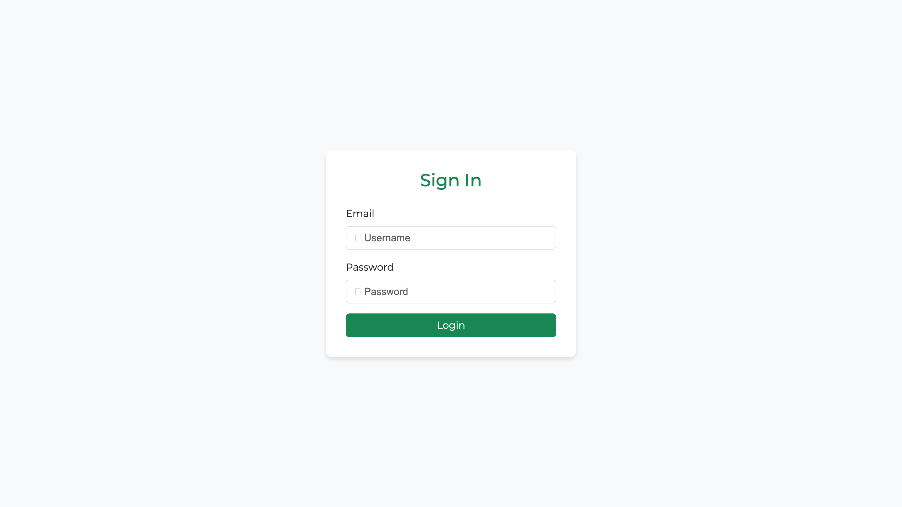
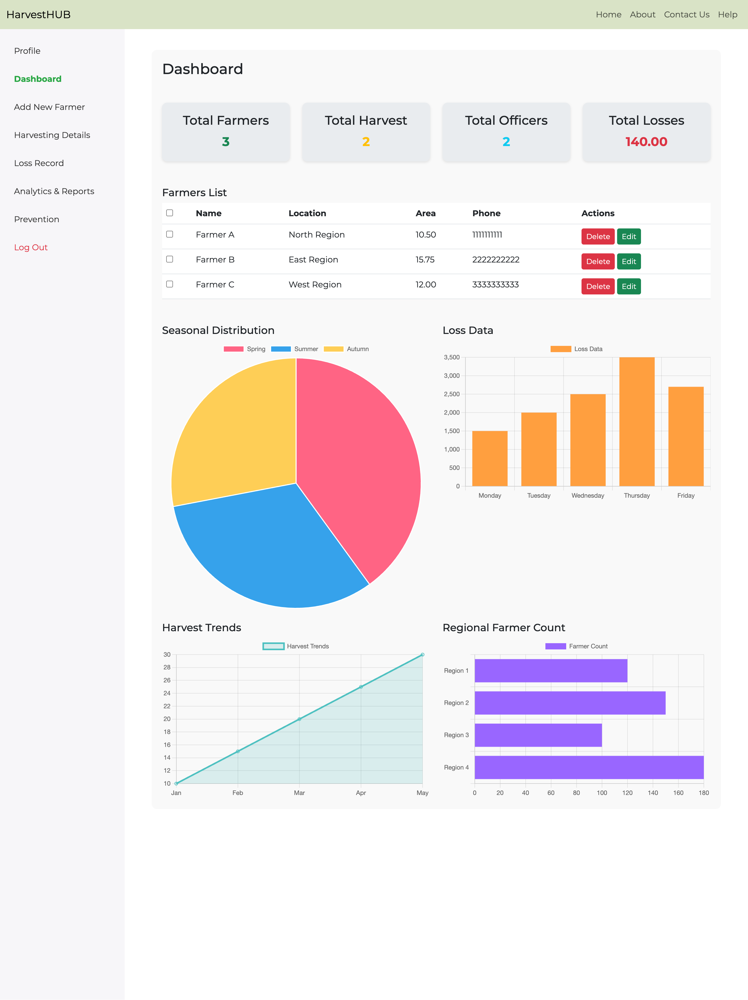
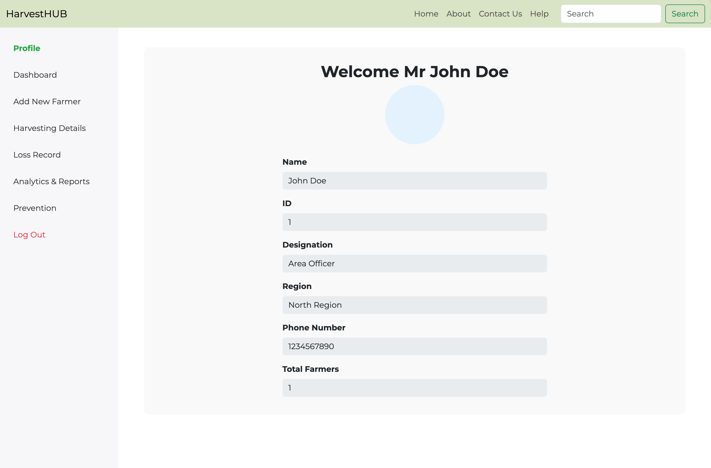
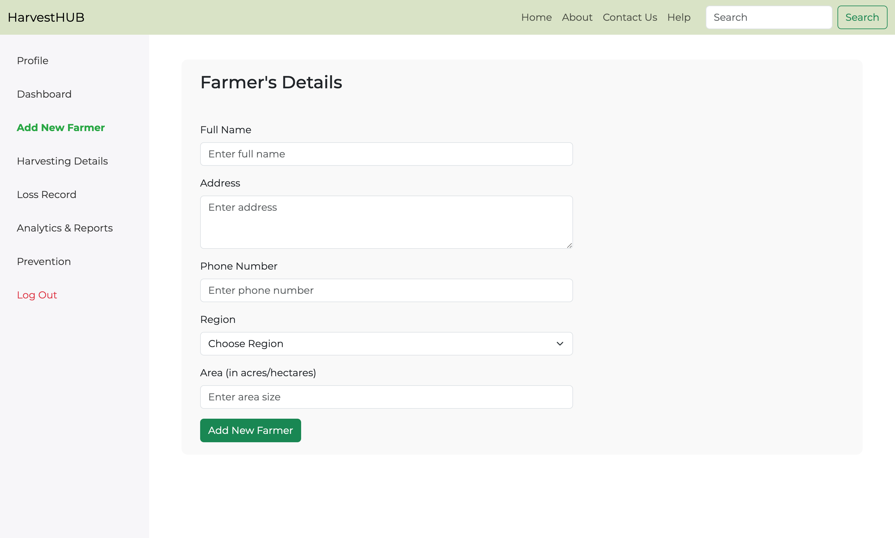
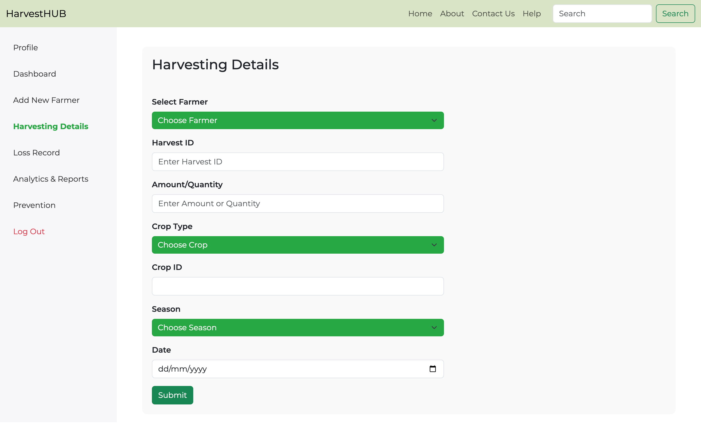
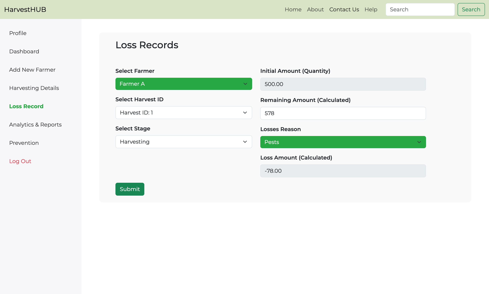
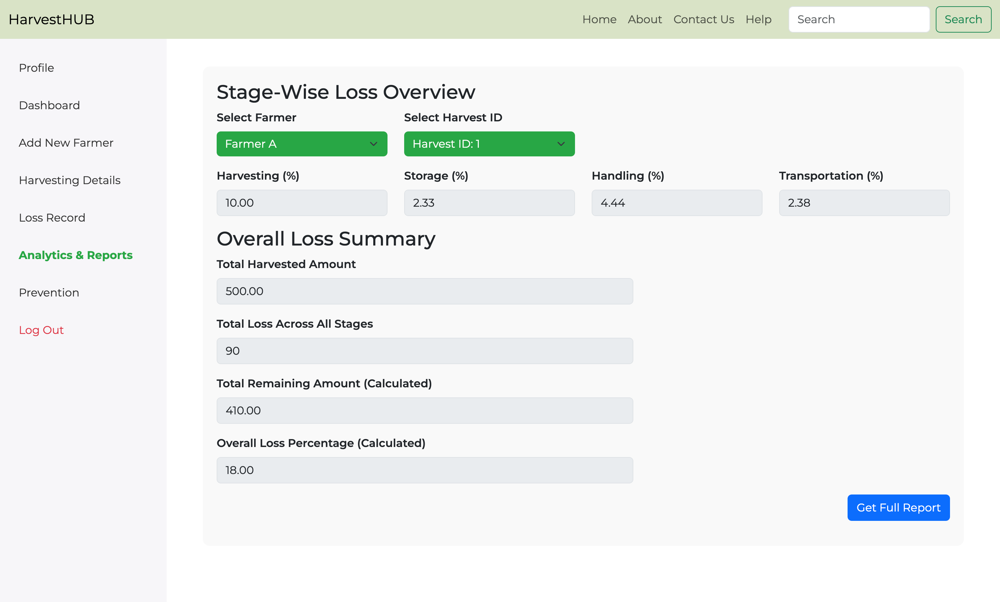
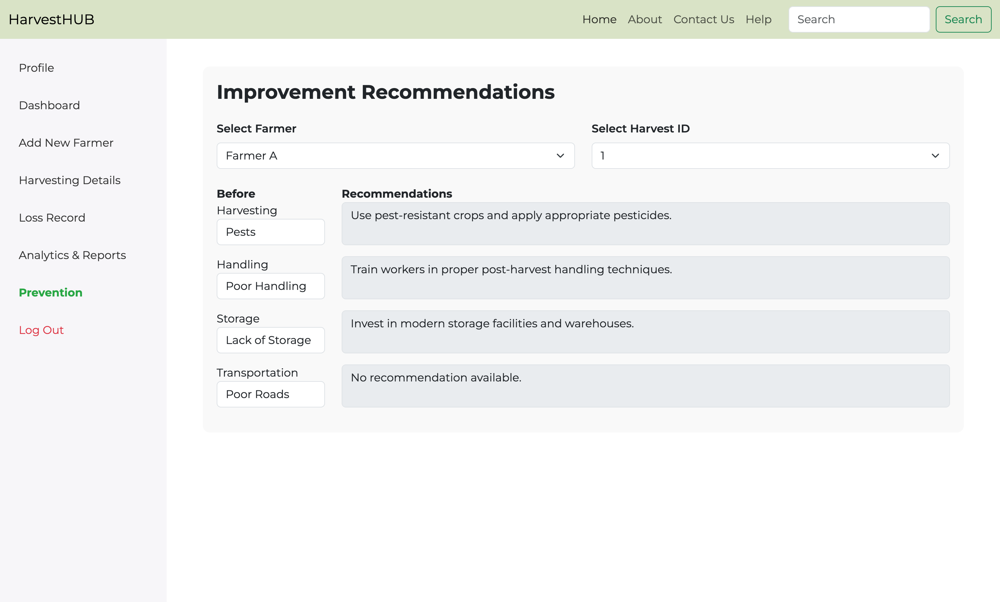

## **HarvestHUB Application**

## **Overview**
**HarvestHUB** is a web-based application designed to help area officers and farmers monitor post-harvest processes, analyze losses, and streamline workflows. The application provides functionalities such as tracking farmer details, recording harvests, analyzing losses, and generating reports.

---

## **Features**
1. **User Authentication**  
   - Secure login for area officers.  

2. **Farmer Management**  
   - Add, update, and delete farmer records.  
   - View detailed farmer information.  

3. **Harvest Management**  
   - Record and manage harvest details.  
   - Analyze loss data across stages (Harvesting, Handling, Storage, Transportation).  

4. **Loss Analysis**  
   - Record losses and reasons at each post-harvest stage.  
   - Generate reports and provide loss prevention recommendations.  

5. **Analytics and Reports**  
   - Generate real-time PDF reports.  
   - Display analytics using charts (line, pie, bar, and column charts).  

---

## **Tech Stack**
- **Backend**: Python (Flask Framework)
- **Frontend**: HTML, CSS, JavaScript, Bootstrap
- **Database**: MySQL
- **PDF Generation**: ReportLab
- **Charts**: Placeholder charts (can integrate Chart.js or similar libraries)
- **Deployment**: Local Server / WSGI-compatible servers  

---

## **Installation**

### **1. Clone the Repository**
```bash
git clone https://github.com/yusaislam48/HarvestHub
cd harvesthub
```

### **2. Set Up Virtual Environment**
Create and activate a virtual environment:
```bash
python3 -m venv venv
source venv/bin/activate  # On Windows: venv\Scripts\activate
```

### **3. Install Dependencies**
Ensure all required libraries are installed:
```bash
pip install -r requirements.txt
```

### **4. Set Up Database**
1. Install **MySQL Server** and create a database.
2. Import the SQL file `db_setup.sql` into your MySQL server:
   ```bash
   mysql -u root -p < db_setup.sql
   ```
3. Update your MySQL credentials in `config.py`:
   ```python
   DB_CONFIG = {
       'host': 'localhost',
       'user': 'your_username',
       'password': 'your_password',
       'database': 'harvest_hub'
   }
   ```

---

## **Running the Application**
1. Start the Flask server:
   ```bash
   python app.py
   ```
2. Open a web browser and go to:
   ```
   http://127.0.0.1:5000
   ```

---

## **Endpoints**
| Endpoint                | Method | Description                      |
|-------------------------|--------|----------------------------------|
| `/`                     | GET    | Home Page                        |
| `/login`                | POST   | Login Authentication             |
| `/profile`              | GET    | Officer Profile Page             |
| `/dashboard`            | GET    | Dashboard with Statistics        |
| `/add_new_farmer`       | GET/POST | Add new farmer details           |
| `/harvesting_details`   | GET/POST | Add harvest details              |
| `/loss_record`          | GET/POST | Record losses                    |
| `/analytics_and_reports`| GET    | Generate loss analysis reports   |
| `/generate_report`      | GET    | Generate PDF reports             |
| `/delete_farmer/<id>`   | POST   | Delete a farmer record           |
| `/edit_farmer/<id>`     | POST   | Edit farmer details              |

---

## **Screenshots**
1. **Login Page**  
   

2. **Dashboard Page**  
   

3. **Profile Page**  
   

4. **Add New Farmer Page**  
   

5. **Harvesting Details Page**  
   

6. **Loss Records Page**  
   

7. **Analytics and Reports**  
   

8. **Prevention**  
   


---

## **Contributing**
Contributions are welcome! Follow these steps:
1. Fork the repository.
2. Create a new branch:
   ```bash
   git checkout -b feature-name
   ```
3. Commit your changes:
   ```bash
   git commit -m "Add new feature"
   ```
4. Push to your fork and open a Pull Request.

---

## **Contact**
For any inquiries or support, contact:
- **Email**: yusaislam07@gmail.com
- **GitHub**: [yusaislam48](https://github.com/yusaislam48/)

---
